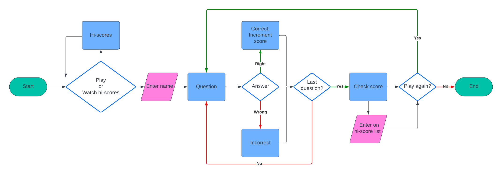

## Reminders

- Your code must be placed in the `run.py` file
- Your dependencies must be placed in the `requirements.txt` file
- Do not edit any of the other files or your code may not deploy properly

## Creating the Heroku app

When you create the app, you will need to add two buildpacks from the _Settings_ tab. The ordering is as follows:

1. `heroku/python`
2. `heroku/nodejs`

You must then create a _Config Var_ called `PORT`. Set this to `8000`

If you have credentials, such as in the Love Sandwiches project, you must create another _Config Var_ called `CREDS` and paste the JSON into the value field.

Connect your GitHub repository and deploy as normal.

## Constraints

The deployment terminal is set to 80 columns by 24 rows. That means that each line of text needs to be 80 characters or less otherwise it will be wrapped onto a second line.

# PP3

[View the website here]()

## Contents

* [How to Play](#how-to-play)

* [Development Process](#development-process)

* [Features](#Features)
  * [Existing Features](#existing-features)
    * [Home page](#home-page)
    * [Game page](#game-page)
  * [Future Implementations](#future-implementations)

* [User Experience](#User-Experience)
  * [User Stories](#User-Stories)

* [Deployment](#Deployment)

* [Design](#Design)
  * [Colour Scheme](#Colour-Scheme)
  * [Typography](#Typography)
  * [Images](#Images)
  * [Wireframe](#wireframe)
  * [Accessibility](#Accessibility)

* [Technologies Used](#Technologies-Used)
  * [Languages Used](#Languages-Used)
  * [Frameworks, Libraries & Programs Used](#frameworks-libraries--programs-used)

* [Testing](#Testing)
  * [Solved Bugs](#solved-bugs)
  * [Known Bugs](#unfixed-bugs)
  
* [Credits](#Credits)
  * [Content](#Content)
  * [Media](#Media)
  * [Tutorials & Code Used](#tutorials--code-used)

## How to Play

The quiz game is quite straightforward. The game presents a question and four alternatives to choose from. The player inputs their selection, and the game checks if it is correct. If it is correct, the game increments the player's score. Otherwise, the player is told that the answer is incorrect.

WHen the game is over, the player can choose to start over from the beginning or quit. If their score is good enough, it will appear on the list of high scores.

## Development Process

Before I began building the project, I made a flowchart to visualize how the program will operate. This flowchart not only helped to determine the order of operations for the program itself, but also gave myself clear directions on where to start and the general sequence of building it.

At one point, when all the functional code was about finished, I discovered that the scoreboard could not function as intended due to the way the deployment works. Since the app could not make persistent overwrites to its text files and thereby save high scores between sessions, I decided to change the code to use an externally hosted spreadsheet.

## Features

### Existing Features

The game features a fairly wide selection of questions. Each round randomizes which questions are used.
This way, each round is unique.

The game saves high scores, and players can view the scoreboard from the main menu. High scores are also on display at the end of each round. At the start of each game, the player gets to write their name. This name is what will go to the scoreboard if they get a good score.

## User Experience

### User stories

__First-time visitor goals__

__Returning visitor goals__

## Design

### Wireframe

### Accessibility

## Technologies Used

### Languages Used

Python

### Frameworks, Libraries, & Programs used

VSCode - Used for all the coding.

Git - For version control.

GitHub - To store files and provide a live site.

## Deployment

The site is deployed using GitHub Pages

To Deploy the site using GitHub Pages:

1. Sign in to Github.
2. Go to the project repository, [EmilionR/card-battle-pp2](https://github.com/EmilionR/card-battle-pp2/commits/main/).
3. Click the settings button.
4. In the left sidebar, select "pages".
5. From the source dropdown select main branch and click save.
6. The site is now deployed, although it might take a few minutes before the site is live.

### Local Development

#### How to Fork the repository

1. Sign in to GitHub.
2. Go to the repository for this project, [EmilionR/card-battle-pp2](https://github.com/EmilionR/card-battle-pp2/commits/main/)
3. Click the Fork button in the top right corner.

#### How to Clone the repository

1. Log in (or sign up) to GitHub.
2. Go to the repository for this project, [EmilionR/card-battle-pp2](https://github.com/EmilionR/card-battle-pp2/commits/main/)
3. Click on the code button, select whether you would like to clone with HTTPS, SSH or GitHub CLI and copy the link shown.
4. Open the terminal in your code editor and change the current working directory to the location you want to use for the cloned directory.
5. Type 'git clone' into the terminal and then paste the link you copied in step 3. Press enter.

## Testing

Please refer to [TESTING.md](TESTING.md) for testing documentation.

### Solved Bugs

1. The game would sometimes crash when trying to load high scores if there were few or no entries in the list.
2. Names in the first place of the scoreboard would lose their first letter when loaded into the game.

### Unfixed Bugs

## Credits

### Content

### Media

### Tutorials & Code Used
