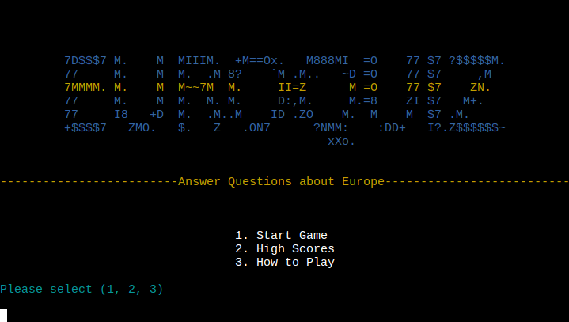

# EuroQuiz - TESTING

Visit live deployed site: [EuroQuiz](https://europe-quiz-pp3-b56221b33626.herokuapp.com/)

* [Validation](#validator-testing)
* [Manual Testing](#manual-testing)
  * [Testing User Stories](#testing-user-stories)
  * [Full Testing](#full-testing)

## Validation

I used PEP8 to validate the code. No errors were found, only minor remarks about spacing and line lenghts.
For example, some inline comments needed more indentation and some lines were too long (in the code, not in the actual program's output). I addressed all these and the reading now comes back completely clean.

## Manual Testing

__Systems Tested__

* Ubuntu
* Windows 10 & 11

__Browsers Tested__
* Google Chrome
* Mozilla Firefox
* Brave
* Microsoft Edge

### Testing User Stories

__First Time Visitors__

| Goals | How are they achieved? |
| --- | --- |
| The game should be easy to understand | The simple rules of the game are explained in the "How to play" section found on the main menu. |
| All instructions should be clear and simple | All essential text is concise and free from big words, options are repeated to the player when relevant. |
| I should be able to mess around without breaking the program | The game handles bad input without problems and does not break if played the wrong way. |
| I should always know what input is expected and why my input gets rejected | The game always reminds the player of what to type. |

__Returning Visitors__

|  Goals | How are they achieved? |
| --- | --- |
| The game should not be a mere repetition of a set sequence of questions | The game features more than twice as many questions as the number asked in a round of the game. Each round uses a random selection of these in a random order. |
| The game should keep track of results and let me look at the scoreboard | Scores are tracked on an external spreadsheet so that it cannot be tampered with or accidentally reset between sessions. The scoreboard persists and it's the same scoreboard for everyone.|
| Program feedback should not be dull and boring | The game will randomly select and combine pieces of feedback for a more human, entertaining feel. |

### Full Testing

__Main Menu__

| Feature | Expected Outcome | Testing Performed | Result | Pass/Fail |
| --- | --- | --- | --- | --- |
| Logo | Logo should load correctly from file | Deploy and start/restart repeatedly | Logo loads correctly | Pass |
| Menu options | Options should print in a centered list | Deploy and start/restart repeatedly | Menu options appear as intended | Pass |
| Input | The player should always be able to choose one of the options | Try all options repeatedly | Input works correctly | Pass |
| Input | Any input other than 1, 2, or 3 should be rejected | Try giving it many types of invalid input | The program throws an exception, displays an error message and returns to the menu if given invalid input | Pass |
| Menu Loop | After viewing the scoreboard or 'how to play' section, the player should return to the main menu. | Open both options repeatedly. | Always returning to the main menu | Pass |

__Game__

| Feature | Expected Outcome | Testing Performed | Result | Pass/Fail |
| --- | --- | --- | --- | --- |
| Name Input | The player can input their name when requested | Play through the game as intended | Name input works as intended | Pass |
| Name Input | The program should validate data and reject names that are invalid | Try inputting a blank name and names that are numerical, non-alphanumeric, or too long | Invalid inputs are always rejected | Pass |
| Questions | Questions should load and display in the right position and not display the correct answer | Try all questions in the game | Questions display as intended | Pass |
| Questions | Questions should appear in a random order and never be repeated within the same round of the game | Play through the game repeatedly | Questions always come at random and never repeat | Pass |
| Input | Any input other than A, B, C, and D should be rejected | Try giving it many types of invalid input | The program throws an exception, displays an error message and returns to the menu if given invalid input | Pass |
| Correction | The game should forward the user's exact input to correction and compare it to the correct answer | Try all questions repeatedly | Answers are always corrected the right way | Pass |
| Score | The game should always award a point after a correct answer, and never after an incorrect | Test the game repeatedly | Points are awaraded as intended | Pass |
| Score | Score must always be incremented, displayed, and stored correctly | Test the game repeatedly | The correct score always shows up after questions, at the end of the game, and on the scoreboard | Pass |
| Keyboard Interrupt | Keyboard interruption via Ctrl+C should not crash the app | Try keyboard interruption throughout the course of the game | The game loop does not break | Pass |
| Scoreboard | The scoreboard should update and display at the end of the game | Test the game repeatedly | Scoreboard always updates and loads correctly | Pass |
| Restart | The player should be able to restart the game at the end of the round, repeatedly, without problems | Test the game repeatedly | Game restarts as intended | Pass |
| Exit screen | When choosing not to restart, the app should display a "thank you" message and then close | Complete the game multiple times and choose not to restart | Message shows and then the app closes | Pass |

__How to Play__

| Feature | Expected Outcome | Testing Performed | Result | Pass/Fail |
| --- | --- | --- | --- | --- |
| Logo | ASCII logo should load correctly | Open and close 'how to play' screen repeatedly | Logo loads as intended | Pass |
| Instructions | Instructions should appear line by line and in position | Open and close 'how to play' screen repeatedly | Instructions appear as intended | Pass |
| Menu Loop | Pressing ENTER should return the user to the main menu | Open and close 'how to play' screen repeatedly | Menu always returns successfully | Pass |

__High Scores__

| Feature | Expected Outcome | Testing Performed | Result | Pass/Fail |
| --- | --- | --- | --- | --- |
| Scoreboard | The scoreboard should display correctly and identically from the main menu and end of the round | Test the scoreboard from both positions repeatedly | Scoreboard appears as intended | Pass |
| Scoreboard | The scoreboard should always come in a neat, centered table with enclosing borders |  The scoreboard should display correctly and identically from the main menu and end of the round | Test the scoreboard from both positions repeatedly | The scoreboard displays as intended | Pass |
| Scores | Scores should be correct and paired with the associated name as stored in the worksheet | Fill and clear the list between rounds, repeatedly | Scores show up as intended | Pass |
| Scores | The scoreboard should always have 10 entries | Add entries to a full list | The list updates and never exceeds 10 entries | Pass |
| Scores | Empty spots should be represented by "----" | Fill and clear the list between rounds, repeatedly | "----" appears as intended | Pass |
| Scores | New scores should overwrite lower scores if the list is full. In the case of a full list of top scores, the early bird keeps its spot |  Fill and clear the list between rounds, repeatedly | Scores overwrite as intended | Pass |
| Persistence | The scoreboard always be up to date and never differ between users or reset after the game | Test the game from different IPs | Scoreboard works as intended | Pass |

[Back to ReadMe](README.md)